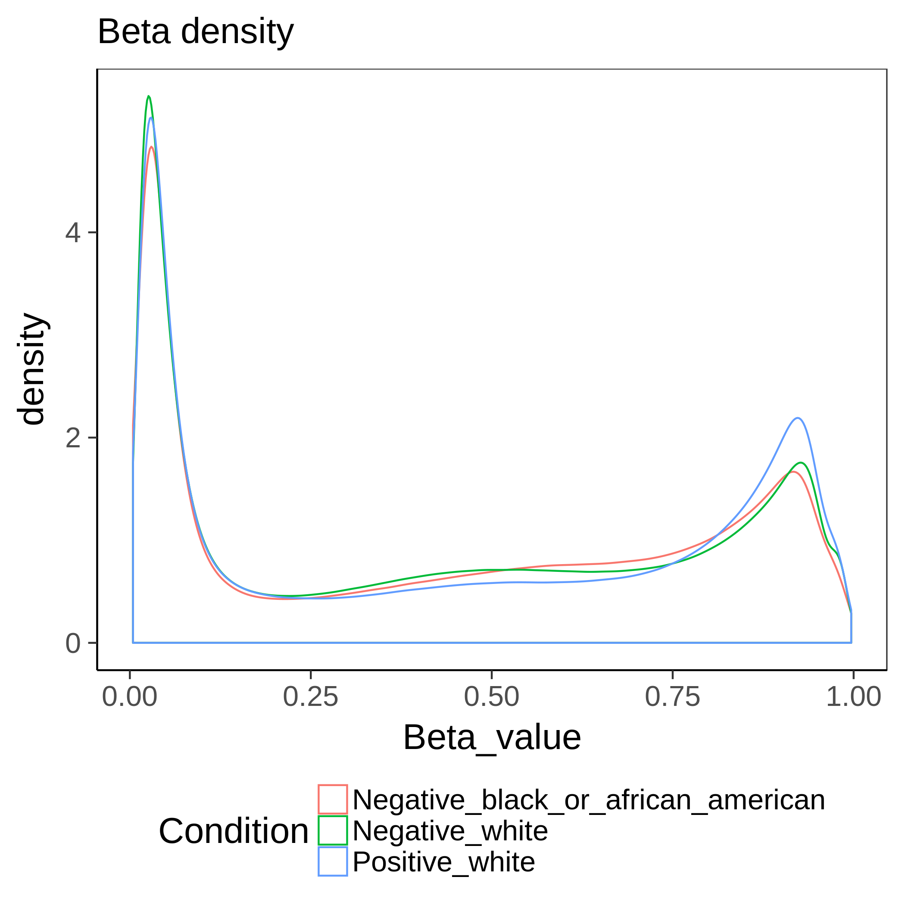

# HNSCMethylationBetweenEthnics
This code download TCGA Methylation data from manifest file, generate analyses including Beta Density Plot, Mean Values By Condition Plot, and adjusted Wilcox p value between "Negative_black_or_african_american", "Negative_white" and "Positive_white". 

Then, using adjusted wilcox p_value and fold change difference between 2 ethnic groups, it classifies the genes into three groups "Fold Change" (FC > 1), :SignificantFC" (p<0.05 & FC > 1) and "Significant (p<0.05). 

This code helps identify the differences in methylation and expression between ethnic groups in head and neck cancer. The user can apply similar analyses for other cancer types. 

# CODE

Methylation.R

The output table includes cg ID, gene symbol, p value, log2 fold change value , and significant status will be created for each group. 
Three output plots including Beta Density Plot, Mean Values By Condition Plot, significant genes plot will be produced. 

# RESULT of HSNC cancer

